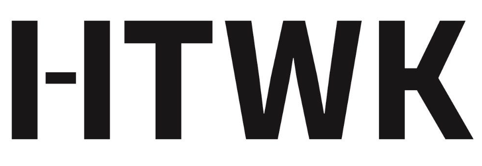
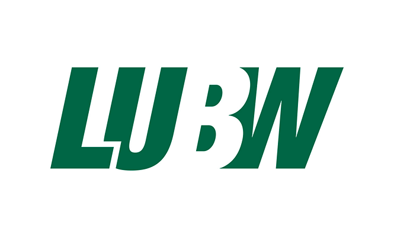

image:https://gitlab.imn.htwk-leipzig.de/fbahr/quatsch-project-22/badges/main/pipeline.svg[link="https://gitlab.imn.htwk-leipzig.de/fbahr/quatsch-project-22/-/commits/main",title="pipeline status"]
image:https://gitlab.imn.htwk-leipzig.de/fbahr/quatsch-project-22/badges/main/coverage.svg[link="https://gitlab.imn.htwk-leipzig.de/fbahr/quatsch-project-22/-/commits/main",title="coverage status"]

[.text-center]

[.text-center]

= QUAtsCH-project-22
:toc:

include::docs/Project Structure.adoc[leveloffset=+1]

== Usage

include::docs/install/Install with Docker.adoc[leveloffset=+2]
include::docs/install/Install with Node.adoc[leveloffset=+2]
include::docs/cli-commands/README.adoc[leveloffset=+2]
