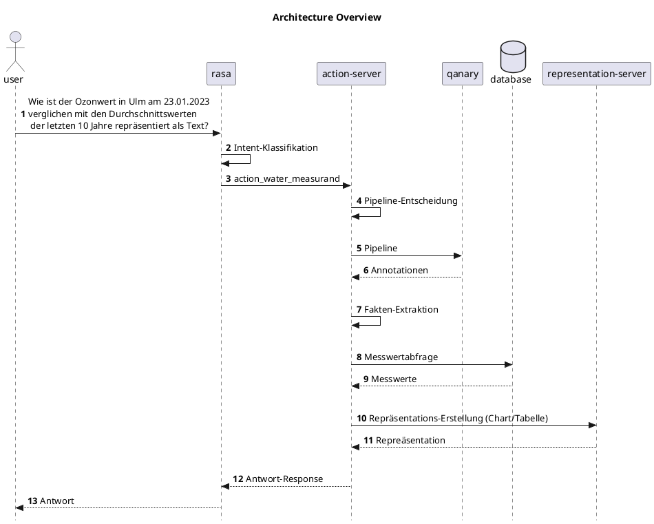
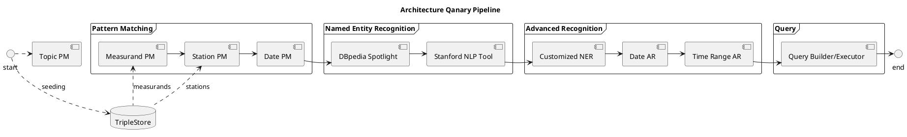

Architecture Overview

```plantuml
@startuml
@startuml Architecture
skinparam Style strictuml
autonumber
skinparam BoxPadding 15

title Architecture Overview

actor "user"

"user" -> rasa: Wie ist der Ozonwert in Ulm am 23.01.2023\nverglichen mit den Durchschnittswerten\n der letzten 10 Jahre repräsentiert als Text?

rasa -> rasa: Intent-Klassifikation

rasa -> "action-server": action_water_measurand
"action-server"-> "action-server": Pipeline-Entscheidung

|||

"action-server" -> qanary: Pipeline
"action-server" <-- qanary: Annotationen

|||

"action-server" -> "action-server": Fakten-Extraktion

|||

database "database"
"action-server" -> "database": Messwertabfrage
"action-server" <-- "database": Messwerte

|||

"action-server" -> "representation-server": Repräsentations-Erstellung (Chart/Tabelle)
"action-server" <-- "representation-server": Repreäsentation

|||

rasa <-- "action-server": Antwort-Response
user <-- rasa: Antwort
@enduml
@enduml
```

Qanary Pipeline

```plantuml
@startuml

title Architecture Qanary Pipeline

frame "Pattern Matching" {
    [Measurand PM]
    [Station PM]
    [Date PM]
}

frame "Named Entity Recognition" {
    [DBpedia Spotlight]
    [Stanford NLP Tool]
}

frame "Advanced Recognition" {
    [Date AR]
    [Time Range AR]
    [Customized NER]
}

frame "Query" {
    [Query Builder/Executor]
}


database TripleStore
start .> [Topic PM]
start ..> TripleStore: seeding

[Measurand PM] <.. TripleStore: measurands
[Station PM] <.. TripleStore: stations

[Measurand PM] -> [Station PM]
[Station PM] -> [Date PM]
[Date PM] -> [DBpedia Spotlight]
[DBpedia Spotlight] -> [Stanford NLP Tool]
[Stanford NLP Tool] -> [Customized NER]
[Customized NER] -> [Date AR]
[Date AR] -> [Time Range AR]
[Time Range AR] -> [Query Builder/Executor]

[Query Builder/Executor] -> end
@enduml
```

